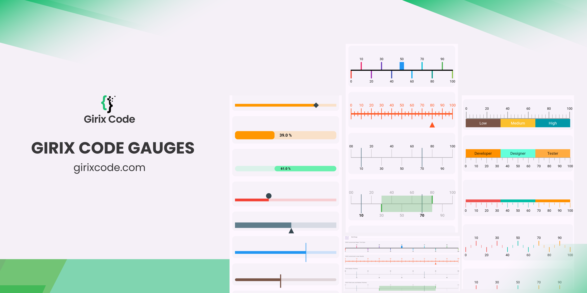

# Girix Code Gauge

A Flutter package for creating customizable progress linear, linear gauges, radial gauges, and more. **girix_code_gauge** provides a collection of widgets to easily integrate dynamic and visually appealing gauges and shapes into the applications.

---

## **Table of Contents**

- [Girix Code Gauge](#girix-code-gauge)
  - [**Table of Contents**](#table-of-contents)
  - [**Features**](#features)
  - [**Preview**](#preview)
  - [**Installation**](#installation)
  - [**Getting Started**](#getting-started)
    - [**Importing the Package**](#importing-the-package)
    - [**Usage Examples**](#usage-examples)
      - [**Progress Linear Gauge**](#progress-linear-gauge)
    - [**Properties**](#properties)
      - [**1. Default**](#1-default)
      - [**2. Add Needle and It's customization**](#2-add-needle-and-its-customization)
      - [**3. Add Label**](#3-add-label)
      - [**4. Animated Progress Linear Gauge**](#4-animated-progress-linear-gauge)
  - [**Customization**](#customization)
  - [**License**](#license)
  - [**Additional Resources**](#additional-resources)

---

## **Features**

- Draw basic gauges like progress, scale, bar linear gauges using customizable widgets.
- Create linear gauges with various styles and animations.
- Implement radial gauges with flexible customization options.
- Support for different needle types and positions.
- Customizable ranges and scales for gauges.
- Animated transitions for gauge values.
- Easy integration and usage with simple APIs.

---

## **Preview**


---

## **Installation**

Add the following to your `pubspec.yaml`:

```yaml
dependencies:
  girix_code_gauge: ^0.0.1
```

Then run:

```dart
flutter pub get
```

---

## **Getting Started**

### **Importing the Package**

Import `girix_code_gauge` in your Dart code:

```dart
import 'package:girix_code_gauge/gauges.dart';
```

### **Usage Examples**

#### **Progress Linear Gauge**

he `GxProgressLinearGauge` widget is used to display a progress linear gauge.

### **Properties**

- `value`: An instance of the `GaugeValue` class that holds the value of the gauge.
  - `value`: The value of the progress linear gauge.
  - `min`: The minimum value of the progress linear gauge.
  - `max`: The maximum value of the progress linear gauge.
- `style`: An instance of the `ProgressLinearStyle` class that holds the style properties of the progress linear gauge.

  - `color`: The color of the active part of the progress linear gauge.
  - `backgroundColor`: The color of the background part of the progress linear gauge.
  - `dense`: Whether the progress linear gauge is dense.
  - `thickness`: The thickness of the progress linear gauge.
  - `radius`: The radius of the progress linear gauge.
  - `strokeCap`: The stroke cap of the progress linear gauge.
  - `paintingStyle`: The painting style of the progress linear gauge.

- `label`: An instance of the `GaugeLabel` class that holds the label properties of the progress linear gauge.

  - `label`: The label of the progress linear gauge.
  - `style`: The style of the label.
  - `textAlign`: The alignment of the label.
  - `spaceExtent`: The space extent of the label.
  - `offset`: The offset of the label.

- `needle`: An instance of the `LinearNeedle` class that holds the needle properties of the progress linear gauge.

  - `enabled`: Whether the needle is enabled.
  - `position`: The position of the needle.
  - `size`: The size of the needle.
  - `color`: The color of the needle.
  - `needleType`: The type of the needle and more.

- `customDrawNeedle`: A function that allows you to draw a custom needle on the progress linear gauge.
- `reverse`: Whether the progress linear gauge is reversed.
- `showLabel`: Whether the label is shown.
- `height`: The height of the progress linear gauge.

##### **1. Default**

Add a simple progress linear gauge widget as a child of any widget.

```dart
SizedBox(
    height: 80
    child: GxProgressLinearGauge(
        value: GaugeValue(value: 50),
    )
)
```

##### **2. Add Needle and It's customization**

Add a linear needle to the progress linear gauge widget by passing the `needle` property. You can customize the needle by changing the `position`, `size`, `color`, and `needleType`.
You can add a style to the gauge by passing the `style` property.

```dart
SizedBox(
    height: 80,
    child: GxProgressLinearGauge(
        value: const GaugeValue(value: 80, min: 0, max: 100),
        style: const ProgressLinearStyle(
            color: Colors.orange,
        ),
        needle: LinearNeedle(
            position: LinearGaugeNeedlePosition.center,
            size: const Size(20, 20),
            color: Colors.blueGrey,
            needleType: LinearGaugeNeedleType.diamond
        )
    )
)
```

##### **3. Add Label**

Add a label to the progress linear gauge widget by passing the `label` property. You can customize the label by changing the `label`, `style`, `textAlign`, and `spaceExtent`. You can show the label by passing the `showLabel` property. The `{value}` in the label will be replaced by the actual value of the gauge.

```dart
SizedBox(
    height: 100,
    child: GxProgressLinearGauge(
        label: GaugeLabel(
            label: '{value} %',
            style: TextStyle(
                color: Colors.black,
                fontSize: 15,
                fontWeight: FontWeight.bold),
            textAlign: TextAlign.center,
            spaceExtent: 4),
        showLabel: true,
        height: 30,
        value: GaugeValue(value: 39, min: 00, max: 100),
        style: ProgressLinearStyle(
            color: Colors.orange, dense: false, thickness: 6),
    ),
)
```

##### **4. Animated Progress Linear Gauge**

Add an animated progress linear gauge widget by passing the `animationType` property of `GxAnimatedProgressLinearGauge` widget. You can customize the animation by changing the `animationType`.
This widget is in **development**. It can be used to show the progress of a task.

```dart
SizedBox(
    height: 80,
    child: GxAnimatedProgressLinearGauge(
        value: 60,
        style: ProgressLinearStyle(
            color: Colors.deepOrange.shade100, thickness: 10),
        animationType: GaugeAnimationType.linear,
        needle: const LinearNeedle(
            position: LinearGaugeNeedlePosition.bottom,
            size: Size(20, 20),
            color: Colors.deepOrange,
            needleType: LinearGaugeNeedleType.triangle),
    )
)
```

## **Customization**

**girix_code_gauge** offers extensive customization options:

- **Needle Types**: Choose from `circle`, `triangle`, `diamond`, `rectangle`, or provide a custom needle.
- **Gauge Styles**: Customize colors, sizes, thicknesses, and more.
- **Animations**: Use built-in animations or define custom animation curves.
- **Scales and Ranges**: Define custom scales, intervals, and ranges for your gauges.
- **Orientation**: Use gauges in both horizontal and vertical orientations.

---

## **License**

This project is licensed under the MIT License - see the [LICENSE](https://github.com/yourusername/girix_code_gauge/blob/main/LICENSE) file for details.

---

## **Additional Resources**

- **Documentation**: API Reference
- **Example Project**: Check out the [example app](./examples/) for a full implementation.
- **Issue Tracker**: Have a bug or a feature request? Please open an [issue](https://github.com/yourusername/girix_code_gauge/issues).

---

**Thank you for using girix_code_gauge!** If you find this package useful, please ⭐ star the repository.

---

_For questions or suggestions, feel free to reach out at <mrutyunjaya@girixcode.com>._
