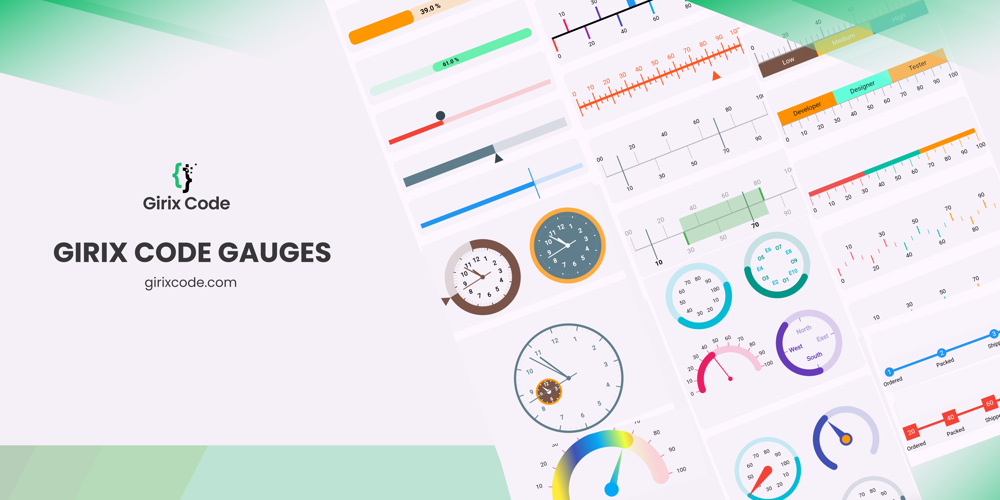
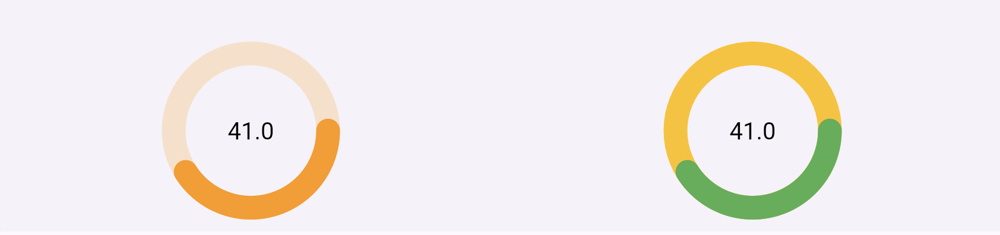

# Girix Code Gauge



A Flutter package for creating customizable progress linear, linear gauges, radial gauges, and more. **girix_code_gauge** provides a collection of widgets to easily integrate dynamic and visually appealing gauges and shapes into the applications.

---

## **Table of Contents**

- [Girix Code Gauge](#girix-code-gauge)
  - [**Table of Contents**](#table-of-contents)
  - [**Features**](#features)
  - [**Preview**](#preview)
  - [](#)
  - [**Installation**](#installation)
  - [**Getting Started**](#getting-started)
    - [**Importing the Package**](#importing-the-package)
    - [**Usage: Linear Gauge**](#usage-linear-gauge)
      - [**Progress Linear Gauge**](#progress-linear-gauge)
        - [**Properties**](#properties)
        - [**1. Default**](#1-default)
        - [**2. Needle**](#2-needle)
          - [**Example**](#example)
        - [**3. Label**](#3-label)
          - [**Example**](#example-1)
        - [**4. Animated Progress Linear Gauge**](#4-animated-progress-linear-gauge)
      - [**Stepper Gauge**](#stepper-gauge)
        - [**1. Default Stepper**](#1-default-stepper)
          - [**Example**](#example-2)
      - [**Scale Linear Gauge**](#scale-linear-gauge)
        - [**Properties of ScaleLinearGauge**](#properties-of-scalelineargauge)
        - [\*_1. Default Scale_](#1-default-scale)
        - [**2. Basic Style**](#2-basic-style)
        - [**3. Axis Tick Position**](#3-axis-tick-position)
          - [**Example**](#example-3)
        - [**4. Axis and Major Tick Style**](#4-axis-and-major-tick-style)
          - [**Example**](#example-4)
        - [**5. Needle**](#5-needle)
          - [**Example**](#example-5)
        - [**6. Fill Area and Marker Pointers**](#6-fill-area-and-marker-pointers)
          - [**Example**](#example-6)
        - [**7. Multi Range**](#7-multi-range)
          - [**Example**](#example-7)
        - [**8. Multi Range: Color on Axis Tick**](#8-multi-range-color-on-axis-tick)
          - [**Example**](#example-8)
        - [**9. Multi Range: Color on Axis Tick for In and Out**](#9-multi-range-color-on-axis-tick-for-in-and-out)
          - [**Example**](#example-9)
    - [**Usage: Radial Gauge**](#usage-radial-gauge)
      - [**GxRadialGauge**](#gxradialgauge)
        - [**Properties**](#properties-1)
        - [**1. Default**](#1-default-1)
          - [**Example 1**](#example-1)
        - [**2. Angle customisation**](#2-angle-customisation)
          - [**Example 2**](#example-2)
        - [**3. Major and minor Tick customisation**](#3-major-and-minor-tick-customisation)
          - [**Example 3**](#example-3)
        - [**4. Needle customisation**](#4-needle-customisation)
          - [**Example 4**](#example-4)
        - [**5. Pointers**](#5-pointers)
          - [**Example 5**](#example-5)
        - [**6. Gradient color**](#6-gradient-color)
          - [**Example 6**](#example-6)
        - [**7. Ranges**](#7-ranges)
          - [**Example 7**](#example-7)
  - [**Customization**](#customization)
  - [**License**](#license)
  - [**Additional Resources**](#additional-resources)

---

## **Features**

- Draw basic gauges like progress, scale, bar linear gauges using customizable widgets.
- Create linear gauges with various styles and animations.
- Implement radial gauges with flexible customization options.
- Support for different needle types and positions.
- Customizable ranges and scales for gauges.
- Animated transitions for gauge values.
- Easy integration and usage with simple APIs.

---

## **Preview**

## 


---

## **Installation**

Add the following to your `pubspec.yaml`:

```yaml
dependencies:
  girix_code_gauge: ^0.0.1
```

Then run:

```dart
flutter pub get
```

---

## **Getting Started**

### **Importing the Package**

Import `girix_code_gauge` in your Dart code:

```dart
import 'package:girix_code_gauge/gauges.dart';
```

### **Usage: Linear Gauge**

#### **Progress Linear Gauge**

The `GxProgressLinearGauge` widget is used to display a progress linear gauge.

##### **Properties**

- `value`: An instance of the `GaugeValue` class that holds the value of the gauge.
  - `value`: The value of the progress linear gauge.
  - `min`: The minimum value of the progress linear gauge.
  - `max`: The maximum value of the progress linear gauge.
- `style`: An instance of the `ProgressLinearStyle` class that holds the style properties of the progress linear gauge.

  - `color`: The color of the active part of the progress linear gauge.
  - `backgroundColor`: The color of the background part of the progress linear gauge.
  - `dense`: Whether the progress linear gauge is dense.
  - `thickness`: The thickness of the progress linear gauge.
  - `radius`: The radius of the progress linear gauge.
  - `strokeCap`: The stroke cap of the progress linear gauge.
  - `paintingStyle`: The painting style of the progress linear gauge.

- `label`: An instance of the `GaugeLabel` class that holds the label properties of the progress linear gauge.

  - `label`: The label of the progress linear gauge.
  - `style`: The style of the label.
  - `textAlign`: The alignment of the label.
  - `spaceExtent`: The space extent of the label.
  - `offset`: The offset of the label.

- `needle`: An instance of the `LinearNeedle` class that holds the needle properties of the progress linear gauge.

  - `enabled`: Whether the needle is enabled.
  - `position`: The position of the needle.
  - `size`: The size of the needle.
  - `color`: The color of the needle.
  - `needleType`: The type of the needle and more.

- `customDrawNeedle`: A function that allows you to draw a custom needle on the progress linear gauge.
- `reverse`: Whether the progress linear gauge is reversed.
- `showLabel`: Whether the label is shown.
- `height`: The height of the progress linear gauge.

##### **1. Default**

Add a simple progress linear gauge widget as a child of any widget.

```dart
SizedBox(
    height: 80
    child: GxProgressLinearGauge(
        value: GaugeValue(value: 50),
    )
)
```

##### **2. Needle**

Add a linear needle to the progress linear gauge widget by passing the `needle` property. You can customize the needle by changing the `position`, `size`, `color`, and `needleType`.
You can add a style to the gauge by passing the `style` property.


###### **Example**

```dart
SizedBox(
    height: 80,
    child: GxProgressLinearGauge(
        value: const GaugeValue(value: 80, min: 0, max: 100),
        style: const ProgressLinearStyle(
            color: Colors.orange,
        ),
        needle: LinearNeedle(
            position: LinearGaugeNeedlePosition.center,
            size: const Size(20, 20),
            color: Colors.blueGrey,
            needleType: LinearGaugeNeedleType.diamond
        )
    )
)
```

##### **3. Label**

Add a label to the progress linear gauge widget by passing the `label` property. You can customize the label by changing the `label`, `style`, `textAlign`, and `spaceExtent`. You can show the label by passing the `showLabel` property. The `{value}` in the label will be replaced by the actual value of the gauge.


###### **Example**

```dart
SizedBox(
    height: 100,
    child: GxProgressLinearGauge(
        label: GaugeLabel(
            label: '{value} %',
            style: TextStyle(
                color: Colors.black,
                fontSize: 15,
                fontWeight: FontWeight.bold),
            textAlign: TextAlign.center,
            spaceExtent: 4),
        showLabel: true,
        height: 30,
        value: GaugeValue(value: 39, min: 00, max: 100),
        style: ProgressLinearStyle(
            color: Colors.orange, dense: false, thickness: 6),
    ),
)
```

##### **4. Animated Progress Linear Gauge**

Add an animated progress linear gauge widget by passing the `animationType` property of `GxAnimatedProgressLinearGauge` widget. You can customize the animation by changing the `animationType`.
This widget is in **development**. It can be used to show the progress of a task.

```dart
SizedBox(
    height: 80,
    child: GxAnimatedProgressLinearGauge(
        value: 60,
        style: ProgressLinearStyle(
            color: Colors.deepOrange.shade100, thickness: 10),
        animationType: GaugeAnimationType.linear,
        needle: const LinearNeedle(
            position: LinearGaugeNeedlePosition.bottom,
            size: Size(20, 20),
            color: Colors.deepOrange,
            needleType: LinearGaugeNeedleType.triangle),
    )
)
```

---

#### **Stepper Gauge**

`GxStepperLinearGauge` is a linear gauge that displays the progress of a process in a step-by-step manner.

Properties of `GxStepperLinearGauge`:

- `value`: The current value of the gauge.
- `stepperPointers`: The list of pointers to be displayed in the gauge. Each pointer represents a step in the process.

##### **1. Default Stepper**


###### **Example**

```dart
 const TextStyle textStyle = TextStyle(
      fontSize: 12,
      color: Colors.black,
    );

GxStepperLinearGauge(
    value: GaugeValue(
        value: 77,
        min: 0,     // Optional
        max: 100    // Optional
    ),
    stepperPointers: [
        StepperPointer(
            label: GaugeLabel(label: 'Ordered', style: textStyle)
        ),
        StepperPointer(
            label: GaugeLabel(label: 'Packed', style: textStyle)
        ),
        StepperPointer(
            label: GaugeLabel(label: 'Shipped', style: textStyle)
        ),
        StepperPointer(
            label: GaugeLabel(label: 'Delivered', style: textStyle)
        )
    ]
),
```

---

#### **Scale Linear Gauge**

The Scale Linear Gauge is used to display a linear gauge with scale with different customization options.

##### **Properties of ScaleLinearGauge**

- `minimum` - The minimum value of the gauge. Default is `0`.
- `maximum` - The maximum value of the gauge. Default is `100`.
- `interval` - The interval value of the gauge. Default is `10`.
- `minorTicksPerInterval` - The number of minor ticks per interval. Default is `1`.
- `axisSpaceExtent` - The space extent of the axis. Default is `0`.
- `labelPosition` - The position of the label. Default is `LinearGaugeLabelPosition.bottomCenter`.
- `tickPosition` - The position of the tick. Default is `LinearElementPosition.inside`.
- `axisTrackStyle` - The style of the axis track. Default is `LinearAxisTrackStyle()`.
- `majorTickStyle` - The style of the major tick. Default is `LinearTickStyle()`.
- `minorTickStyle` - The style of the minor tick. Default is `LinearTickStyle()`.
- `markerPointers` - The list of marker pointers. Default is `null`.
- `barPointers` - The list of bar pointers. Default is `null`.
- `barHeight` - The height of the bar. Default is `10`.
- `barOffset` - The offset of the bar. Default is `0`.
- `needle` - The needle of the gauge. Default is `null`.
- `valueToLabelFormatCallback` - The callback to format the label. Default is `null`.
- `valueToMajorTickStyleCallback` - The callback to format the major tick style. Default is `null`.
- `valueToLabelStyleCallback` - The callback to format the label style. Default is `null`.
- `fillAreaPointers` - The list of fill area pointers. Default is `null`.
- `showAxisLabel` - Whether to show the axis label. Default is `true`.
- `showAxisTrack` - Whether to show the axis track. Default is `true`.
- `showMinorTicks` - Whether to show the minor ticks. Default is `true`.

##### \*_1. Default Scale_

Create a default scale linear gauge widget and add it to your widget.

```dart
GxScaleLinearGauge()
```

##### **2. Basic Style**

Create a scale linear gauge widget with basic customized style with minimum, maximum, interval, minorTicksPerInterval, axisSpaceExtent, majorTickStyle.

```dart
GxScaleLinearGauge(
  minimum: 0,
  maximum: 100,
  interval: 20,
  minorTicksPerInterval: 5,
  axisSpaceExtent: 2,
  majorTickStyle: LinearTickStyle(
    length: 20,
    thickness: 2,
    color: Colors.blue,
  )
)
```

##### **3. Axis Tick Position**

Create a scale linear gauge widget with tick position such as `inside`, `outside`, `outAndIn`, `inAndOut`.

<!--  -->


###### **Example**

```dart
GxScaleLinearGauge(
    tickPosition: LinearElementPosition.inside,
    minorTickStyle: LinearTickStyle(
        length: 20,
        thickness: 1,
    ),
    majorTickStyle: LinearTickStyle(
        length: 40,
        thickness: 1,
    ),
    axisTrackStyle: LinearAxisTrackStyle(
        thickness: 2, strokeCap: StrokeCap.butt, color: Colors.orange
    )
 )
```

##### **4. Axis and Major Tick Style**

Create a scale linear gauge widget with customized axis and major tick style with `axisLabelStyle`, `valueToLabelFormatCallback`, `labelPosition`, `majorTickStyle`, `axisTrackStyle`, `minorTickStyle` properties.

<!--  -->


###### **Example**

```dart
GxScaleLinearGauge(
    tickPosition: LinearElementPosition.inAndOut,
    minorTickStyle: const LinearTickStyle(
        length: 10,
        thickness: 1,
    ),
    majorTickStyle: const LinearTickStyle(
        length: 60,
        thickness: 4,
    ),
    axisTrackStyle: const LinearAxisTrackStyle(
        thickness: 4, strokeCap: StrokeCap.round, color: Colors.black),
    showMinorTicks: false,
    valueToMajorTickStyleCallback: (value, index) {
        return LinearTickStyle(
        length: 60,
        thickness: value == 50 ? 16 : 4,
        color: Colors.primaries[index % Colors.primaries.length],
        );
    },
)
```

##### **5. Needle**

Create a scale linear gauge widget with customized linear needle with `needle`, `offset`, `enabled`, `color`, `size`, `position`, `needleType` properties.

<!--  -->


###### **Example**

```dart
GxScaleLinearGauge(
    minimum: 0,
    maximum: 100,
    interval: 10,
    minorTicksPerInterval: 2,
    axisLabelStyle: const TextStyle(
        color: Colors.deepOrange,
        fontSize: 14,
    ),
    valueToLabelFormatCallback: (value, index) => value,
    labelPosition: LinearGaugeLabelPosition.topCenter,
    majorTickStyle: const LinearTickStyle(
        length: 40,
        thickness: 2,
        color: Colors.deepOrange,
    ),
    axisTrackStyle: const LinearAxisTrackStyle(
        color: Colors.deepOrange,
    ),
    minorTickStyle: const LinearTickStyle(
        color: Colors.deepOrange, thickness: 2, length: 18),
    value: 80,
    needle: const LinearNeedle(
        offset: 20,
        enabled: true,
        color: Colors.deepOrange,
        size: Size(20, 20),
        position: LinearGaugeNeedlePosition.bottom,
        needleType: LinearGaugeNeedleType.triangle,
    )
)
```

##### **6. Fill Area and Marker Pointers**

Create a scale linear gauge widget with fill area and marker pointers with `fillAreaPointers`, `markerPointers` properties.

<!--  -->


###### **Example**

```dart
GxScaleLinearGauge(
    tickPosition: LinearElementPosition.outAndIn,
    minorTickStyle: const LinearTickStyle(
        length: 10,
        thickness: 1,
    ),
    majorTickStyle: const LinearTickStyle(
        length: 60,
        thickness: 1,
    ),
    axisTrackStyle: const LinearAxisTrackStyle(
        thickness: 2,
        strokeCap: StrokeCap.round,
        color: Colors.black26),
    showMinorTicks: false,
    valueToMajorTickStyleCallback: (value, index) {
        return LinearTickStyle(
        length: 60,
        thickness: (value == 30 || value == 80) ? 4 : 1,
        color: (value == 30 || value == 80)
            ? Colors.green
            : Colors.black26,
        );
    },
    valueToLabelFormatCallback: (value, index) =>
        value.length == 1 ? '0$value' : value,
    markerPointers: [
        LinearMarkerPointer(
            value: 10,
            needle: const LinearNeedle(
                enabled: true,
                color: Colors.blueGrey,
                size: Size(2, 70),
                position: LinearGaugeNeedlePosition.center,
                needleType: LinearGaugeNeedleType.pipe,
                offset: 10,
            ),
        ),
        LinearMarkerPointer(
            value: 70,
            needle: const LinearNeedle(
                enabled: true,
                color: Colors.blueGrey,
                size: Size(2, 70),
                position: LinearGaugeNeedlePosition.center,
                needleType: LinearGaugeNeedleType.pipe,
                offset: 10,
            ),
        ),
    ],
    valueToLabelStyleCallback: (value, index) => TextStyle(
        color:
            (value == 10 || value == 70) ? Colors.black : Colors.black38,
        fontWeight: (value == 10 || value == 70)
            ? FontWeight.bold
            : FontWeight.normal,
    ),
    fillAreaPointers: [
        FillAreaPointer(
            thickness: 60,
            startValue: 30,
            endValue: 80,
            color: Colors.green.withOpacity(0.3))
        ],
    )
```

##### **7. Multi Range**

Create a range scale linear gauge with multiple ranges.

<!--  -->


###### **Example**

```dart
GxScaleLinearGauge(
    minimum: 0,
    maximum: 100,
    interval: 20,
    minorTicksPerInterval: 5,
    axisSpaceExtent: 2,
    labelPosition: LinearGaugeLabelPosition.topCenter,
    tickPosition: LinearElementPosition.outside,
    axisTrackStyle: const LinearAxisTrackStyle(
        thickness: 3,
    ),
    majorTickStyle: const LinearTickStyle(
        length: 50,
        thickness: 2,
    ),
    minorTickStyle: const LinearTickStyle(
        length: 30,
        thickness: 1,
    ),
    barOffset: 1,
    barHeight: 35,
    barPointers: [
    LinearBarPointer(
        label: const GaugeLabel(label: 'Low'),
        value: barValue,
        thickness: 5,
        color: Colors.brown),
    LinearBarPointer(
        label: const GaugeLabel(label: 'Medium'),
        color: Colors.yellow.shade700,
        value: barValue,
        thickness: 5),
    LinearBarPointer(
        label: const GaugeLabel(label: 'High'),
        color: Colors.cyan.shade700,
        value: barValue,
        thickness: 5),
    ]
)
```

##### **8. Multi Range: Color on Axis Tick**

Create a range scale linear gauge with multiple ranges and apply bar color on axis tick using `applyBarColorOnAxisTick` property.

<!--  -->


###### **Example**

```dart
GxScaleLinearGauge(
    tickPosition: LinearElementPosition.inside,
    labelPosition: LinearGaugeLabelPosition.bottomCenter,
    minorTickStyle: const LinearTickStyle(
        length: 20,
        thickness: 1,
    ),
    majorTickStyle: const LinearTickStyle(
        length: 40,
        thickness: 1,
    ),
    barHeight: 10,
    barOffset: 80,
    applyBarColorOnAxisTick: true,
    barPointers: [
    LinearBarPointer(
        value: barValue, thickness: 5, color: Colors.red.shade400),
    LinearBarPointer(
        color: Colors.tealAccent.shade700,
        value: barValue,
        thickness: 5),
    LinearBarPointer(
        color: Colors.orangeAccent.shade400,
        value: barValue,
        thickness: 5),
    ]
),
```

##### **9. Multi Range: Color on Axis Tick for In and Out**

Create a range scale linear gauge with multiple ranges and apply bar color on axis tick for in and out.

<!--  -->


###### **Example**

```dart
GxScaleLinearGauge(
    tickPosition: LinearElementPosition.inAndOut,
    minorTickStyle: const LinearTickStyle(
        length: 10,
        thickness: 1,
    ),
    majorTickStyle: const LinearTickStyle(
        length: 40,
        thickness: 2,
    ),
    applyBarColorOnAxisTick: true,
    barPointers: [
        LinearBarPointer(
            value: barValue, thickness: 5, color: Colors.red.shade400),
        LinearBarPointer(
            color: Colors.tealAccent.shade700,
            value: barValue,
            thickness: 5),
        LinearBarPointer(
            color: Colors.orangeAccent.shade400,
            value: barValue,
            thickness: 5),
        ]
    )
```

### **Usage: Radial Gauge**

#### **GxRadialGauge**

The `GxRadialGauge` widget is used to display a RadialGauge with different styles of customization.

##### **Properties**

- `value` : The value of the gauge. The value is required.
- `style` : The style of the gauge. The default value is `RadialGaugeStyle()`. The style is optional.
- `size` : The size of the gauge. The default value is `Size(200, 200)`. The size is optional.
- `labelTickStyle` : The style of the label tick. The default value is `RadialTickLabelStyle()`. The labelTickStyle is optional.
- `showMajorTicks` : The default value is `false`. The showMajorTicks is optional.
- `showMinorTicks` : The default value is `false`. The showMinorTicks is optional.
- `showLabels` : The default value is `false`. The showLabels is optional.
- `majorTickStyle` : The default value is `RadialTickStyle()`. The majorTickStyle is optional.
- `minorTickStyle` : The default value is `RadialTickStyle()`. The minorTickStyle is optional.
- `interval` : The default value is `10`. The interval is optional.
- `minorTicksPerInterval` : The default value is `10`. The minorTicksPerInterval is optional.
- `startAngleInDegree` : The default value is `0`. The startAngleInDegree is optional.
- `sweepAngleInDegree` : The default value is `360`. The sweepAngleInDegree is optional.
- `showValueAtCenter` : The default value is `true`. The showValueAtCenter is optional.
- `showNeedle` : The default value is `false`. The showNeedle is optional.
- `needle` : The needle of the gauge. The needle is optional.
- `valueToLabelFormatCallback` : The value to label format callback. The valueToLabelFormatCallback is optional.
- `valueToLabelStyleCallback` : The value to label style callback. The valueToLabelStyleCallback is optional.
- `valueToMajorTickCallback` : The value to label style callback. The valueToMajorTickCallback is optional.
- `pointers` : The radial pointers. The pointers is optional.
- `rangeBars` : The range bars. The rangeBars is optional.

##### **1. Default**



###### **Example 1**

```dart
GxRadialGauge(
    size: twinSize,
    value: GaugeValue(
        value: value,
    ),
    style: const RadialGaugeStyle(
        color: Colors.orange, thickness: 20
    )
),
GxRadialGauge(
    size: twinSize,
    value: GaugeValue(
        value: value,
    ),
    style: const RadialGaugeStyle(
        backgroundColor: Colors.amber,
        color: Colors.green,
        thickness: 20
    )
),
```

##### **2. Angle customisation**

By using `startAngleInDegree` and `sweepAngleInDegree` properties, we can customise the start and swipe angle of the gauge.
Find out more about angle on canvas, visit [flutter canvas arc](https://flutter.github.io/assets-for-api-docs/assets/dart-ui/canvas_draw_arc.png#gh-light-mode-only)


###### **Example 2**

```dart
 GxRadialGauge(
    showValueAtCenter: true,
    size: twinSize,
    startAngleInDegree: 180,
    sweepAngleInDegree: 180,
    value: GaugeValue(
        value: value,
    ),
    style: const RadialGaugeStyle(
        strokeCap: StrokeCap.butt,
        color: Colors.amber,
        thickness: 20
    )
),
GxRadialGauge(
    showValueAtCenter: true,
    size: twinSize,
    startAngleInDegree: 270,
    sweepAngleInDegree: 180,
    value: GaugeValue(
        value: value,
    ),
    style: RadialGaugeStyle(
        color: Colors.cyanAccent.shade700,
        thickness: 20
    )
),
```

##### **3. Major and minor Tick customisation**

By using `majorTickStyle` and `minorTickStyle` properties, we can customise the major and minor ticks of the gauge respectively.


###### **Example 3**

```dart
// 1st row
GxRadialGauge(
    size: twinSize,
    startAngleInDegree: 135,
    sweepAngleInDegree: 270,
    value: GaugeValue(
        value: 75,
    ),
    showMajorTicks: true,
    interval: 10,
    majorTickStyle: const RadialTickStyle(
        position: RadialElementPosition.inside,
        alignment: RadialElementAlignment.end,
        length: 20,
        thickness: 2,
        color: Colors.blue),
    style:
        const RadialGaugeStyle(color: Colors.blue, thickness: 20),
),
GxRadialGauge(
    size: twinSize,
    startAngleInDegree: 180,
    value: GaugeValue(
        value: 75,
    ),
    showMajorTicks: true,
    interval: 5,
    valueToMajorTickCallback: (value, index) {
    final bool isOdd = index.isOdd;
    return RadialTickStyle(
        position: RadialElementPosition.outside,
        alignment: RadialElementAlignment.start,
        length: 20,
        thickness: 2,
        color: isOdd
            ? Colors.deepOrange.shade200
            : Colors.deepOrange.shade300);
    },
    style: const RadialGaugeStyle(
        color: Colors.deepOrange, thickness: 20),
),

// 2nd row
 GxRadialGauge(
    value: GaugeValue(
        value: 75,
    ),
    showMajorTicks: true,
    showMinorTicks: true,
    minorTicksPerInterval: 20,
    showLabels: true,
    interval: 10,
    labelTickStyle: const RadialTickLabelStyle(
        padding: 2, position: RadialElementPosition.outside),
    majorTickStyle: const RadialTickStyle(
        position: RadialElementPosition.inside,
        alignment: RadialElementAlignment.end,
        length: 20,
        thickness: 2,
        color: Colors.red),
    minorTickStyle: const RadialTickStyle(
        position: RadialElementPosition.outside,
        alignment: RadialElementAlignment.center,
        length: 20,
        thickness: 1,
        color: Colors.redAccent),
    style: const RadialGaugeStyle(
        strokeCap: StrokeCap.butt,
        color: Colors.orangeAccent,
        thickness: 25),
),
GxRadialGauge(
    value: GaugeValue(
        value: 75,
    ),
    showMajorTicks: true,
    showMinorTicks: true,
    showLabels: true,
    interval: 10,
    majorTickStyle: const RadialTickStyle(
        position: RadialElementPosition.inside,
        alignment: RadialElementAlignment.center,
        length: 15,
        thickness: 3,
        color: Colors.blue),
    minorTickStyle: const RadialTickStyle(
        position: RadialElementPosition.outside,
        alignment: RadialElementAlignment.center,
        length: 20,
        thickness: 1,
        color: Colors.lightBlueAccent),
    style: const RadialGaugeStyle(
        color: Colors.lightBlueAccent, thickness: 15),
),
```

##### **4. Needle customisation**

By using `needle` property, we can customise the needle of the gauge. The `showNeedle` property is used to show and hide the needle.


###### **Example 4**

```dart
// 1st row
GxRadialGauge(
    showValueAtCenter: false,
    value: GaugeValue(
        value: 75,
    ),
    showLabels: true,
    interval: 10,
    showNeedle: true,
    needle: const RadialNeedle(
        circle: NeedleCircle(
            radius: 10, paintingStyle: PaintingStyle.fill),
        color: Colors.red,
        bottomOffset: 1.0,
        thickness: 20,
        topOffest: 0,
        alignment: RadialElementAlignment.start),
    style:
        const RadialGaugeStyle(color: Colors.cyan, thickness: 10),
),
GxRadialGauge(
    showValueAtCenter: false,
    startAngleInDegree: 135,
    sweepAngleInDegree: 270,
    value: GaugeValue(
        value: 75,
    ),
    interval: 10,
    showNeedle: true,
    needle: const RadialNeedle(
        circle: NeedleCircle(
            radius: 12,
            strokeWidth: 5,
            innerColor: Colors.orange,
            paintingStyle: PaintingStyle.stroke),
        color: Colors.indigo,
        bottomOffset: 1.0,
        thickness: 20,
        topOffest: 0,
        alignment: RadialElementAlignment.end),
    style: const RadialGaugeStyle(
        color: Colors.indigo, thickness: 15),
),

// 2nd row
GxRadialGauge(
    showValueAtCenter: false,
    startAngleInDegree: 90,
    sweepAngleInDegree: 180,
    size: twinSize,
    value: GaugeValue(
        value: 75
    ),
    interval: 10,
    showNeedle: true,
    showMajorTicks: true,
    valueToMajorTickCallback: (tickValue, index) {
    return RadialTickStyle(
        position: RadialElementPosition.inside,
        alignment: RadialElementAlignment.end,
        length: 12,
        thickness: 2,
        color: tickValue < value
            ? Colors.amber
            : Colors.amber.withOpacity(0.3)
        );
    },
    needle: const RadialNeedle(
        circle: NeedleCircle(
            radius: 8,
            strokeWidth: 5,
            innerColor: Colors.orange,
            paintingStyle: PaintingStyle.fill
        ),
        color: Colors.brown,
        bottomOffset: 20.0,
        thickness: 10,
        topOffest: 12,
        alignment: RadialElementAlignment.start
    ),
    style: const RadialGaugeStyle(
        color: Colors.amber, thickness: 15
    )
),
GxRadialGauge(
    showValueAtCenter: false,
    size: twinSize,
    value: GaugeValue(
        value: 75
    ),
    showLabels: true,
    interval: 10,
    showNeedle: true,
    needle: const RadialNeedle(
        shape: RadialNeedleShape.line,
        circle: NeedleCircle(
            radius: 8,
            strokeWidth: 4,
            paintingStyle: PaintingStyle.stroke
        ),
        color: Colors.grey,
        bottomOffset: 20.0,
        thickness: 4,
        topOffest: 0,
        alignment: RadialElementAlignment.start
    ),
    style: const RadialGaugeStyle(
        color: Colors.blueGrey, thickness: 10
    )
),
```

##### **5. Pointers**

By using `pointers` property, we can add pointers to the gauge.


###### **Example 5**

```dart
 GxRadialGauge(
    showValueAtCenter: false,
    startAngleInDegree: 270,
    size: twinSize,
    value: GaugeValue(value: ratioValue, min: 0, max: 144),
    showLabels: true,
    labelTickStyle: const RadialTickLabelStyle(
        padding: 20,
    ),
    interval: 12,
    style: const RadialGaugeStyle(
        color: Colors.pinkAccent, thickness: 15),
    valueToLabelFormatCallback: (value, index) {
        if (index == 0) {
            return '';
        }
        return (value / 12).toInt().toString();
    },
    pointers: [
        RadialPointer(
            value: ratioValue,
            shape: RadialPointerShape.circle,
            showNeedle: false,
            style: const RadialPointerStyle(
                color: Colors.indigoAccent,
                paintingStyle: PaintingStyle.fill,
                size: 12,
                thickness: 2
            ),
        ),
        RadialPointer(
            value: hours * 5,
            shape: RadialPointerShape.circle,
            showPointer: false,
            style: const RadialPointerStyle(
                color: Colors.blueGrey,
                paintingStyle: PaintingStyle.fill,
                size: 12,
                thickness: 2),
            needle: const RadialNeedle(
                thickness: 3.5,
                topOffest: -30,
                color: Colors.black,
                shape: RadialNeedleShape.line,
                alignment: RadialElementAlignment.end
            )
        ),
        RadialPointer(
            value: minutes,
            showPointer: false,
            needle: const RadialNeedle(
                thickness: 2.5,
                color: Colors.indigo,
                shape: RadialNeedleShape.line,
                topOffest: -10,
                alignment: RadialElementAlignment.end
            )
        ),
        RadialPointer(
            value: seconds,
            showPointer: false,
            needle: const RadialNeedle(
                thickness: 2,
                color: Colors.indigo,
                shape: RadialNeedleShape.line,
                topOffest: -28,
                bottomOffset: 10,
                alignment: RadialElementAlignment.end
            )
        ),
    ],
),
GxRadialGauge(
    showValueAtCenter: false,
    size: twinSize,
    startAngleInDegree: 180,
    value: GaugeValue(
        value: 75,
    ),
    interval: 20,
    style: const RadialGaugeStyle(
        color: Colors.indigoAccent, thickness: 15),
    pointers: [
        RadialPointer(
            alignment: RadialElementAlignment.start,
            value: value,
            shape: RadialPointerShape.triangle,
            style: const RadialPointerStyle(
                color: Colors.indigoAccent,
                paintingStyle: PaintingStyle.fill,
                size: 20,
                thickness: 2
            ),
        ),
        RadialPointer(
            value: value,
            shape: RadialPointerShape.circle,
            alignment: RadialElementAlignment.center,
            showNeedle: true,
            showPointer: true,
            style: const RadialPointerStyle(
                color: Colors.pinkAccent,
                paintingStyle: PaintingStyle.fill,
                size: 12,
                thickness: 2
            ),
            needle: const RadialNeedle(
                thickness: 2,
                bottomOffset: 20,
                circle: NeedleCircle(
                    color: Colors.pinkAccent,
                    strokeWidth: 3,
                    paintingStyle: PaintingStyle.stroke),
                color: Colors.pinkAccent,
                shape: RadialNeedleShape.line,
                alignment: RadialElementAlignment.end
            )
        ),
    ],
),
```

##### **6. Gradient color**

By using `gradient` property of the `RadialGaugeStyle` , we can customise the style of the gauge.


###### **Example 6**

```dart
GxRadialGauge(
    showValueAtCenter: true,
    value: GaugeValue(
        value: value,
    ),
    showLabels: false,
    labelTickStyle: const RadialTickLabelStyle(
        padding: 30,
    ),
    interval: 10,
    style: const RadialGaugeStyle(
        color: Colors.cyan,
        thickness: 35,
        gradient: LinearGradient(
            colors: [
                Colors.cyan,
                Colors.blue,
                Colors.purple,
                Colors.pinkAccent,
                Colors.redAccent,
            ],
            begin: Alignment.topCenter,
            end: Alignment.bottomCenter,
            stops: [0.0, 0.2, 0.4, 0.6, 1.0]
        ),
    ),
),
GxRadialGauge(
    showValueAtCenter: false,
    startAngleInDegree: 180,
    sweepAngleInDegree: 180,

    value: GaugeValue(
        value: 75,
    ),
    showLabels: true,
    showMajorTicks: true,
    showNeedle: true,
    needle: const RadialNeedle(
        color: Colors.lightBlue,
        shape: RadialNeedleShape.tapperedLine,
        thickness: 18,
        alignment: RadialElementAlignment.end,
        circle: NeedleCircle(
            radius: 15,
        ),
        gradient: LinearGradient(colors: [
            Colors.yellow,
            Colors.indigo,
            Colors.lightBlue,
            Colors.limeAccent,
            Colors.redAccent,
        ]),
    ),
    majorTickStyle: const RadialTickStyle(
        color: Colors.pink,
        thickness: 1,
        length: 25,
        position: RadialElementPosition.outside,
        alignment: RadialElementAlignment.start
    ),
    labelTickStyle: const RadialTickLabelStyle(
        padding: 20,
        position: RadialElementPosition.outside,
    ),
    interval: 10,
    style: const RadialGaugeStyle(
        color: Colors.pink,
        thickness: 35,
        backgroundGradient: LinearGradient(colors: [
            Colors.yellow,
            Colors.indigo,
            Colors.lightBlue,
            Colors.limeAccent,
            Colors.redAccent,
        ]),
        gradient: LinearGradient(colors: [
            Colors.yellow,
            Colors.indigo,
            Colors.lightBlue,
            Colors.limeAccent,
            Colors.redAccent,
        ]),
    ),
)
```

##### **7. Ranges**

By using `rangeBars` property, we can plot the range bars.


###### **Example 7**

```dart
GxRadialGauge(
    value: GaugeValue(
        value: 75,
    ),
    showLabels: true,
    labelTickStyle: const RadialTickLabelStyle(
        padding: 30,
    ),
    interval: 10,
    style: const RadialGaugeStyle(
        color: Colors.cyan,
        thickness: 5,
    ),
    rangeBars: const [
        RadialBarRange(
            offset: 10,
            height: 30,
            startValue: 0,
            endValue: 33,
            color: Colors.green,
        ),
        RadialBarRange(
            height: 30,
            startValue: 33,
            endValue: 66,
            color: Colors.yellow,
        ),
        RadialBarRange(
            height: 30,
            startValue: 66,
            endValue: 100,
            color: Colors.red,
        ),
    ],
),
```

## **Customization**

**girix_code_gauge** offers extensive customization options:

- **Needle Types**: Choose from `circle`, `triangle`, `diamond`, `rectangle`, or provide a custom needle.
- **Gauge Styles**: Customize colors, sizes, thicknesses, and more.
- **Animations**: Use built-in animations or define custom animation curves.
- **Scales and Ranges**: Define custom scales, intervals, and ranges for your gauges.
- **Orientation**: Use gauges in both horizontal and vertical orientations.

---

## **License**

This project is licensed under the MIT License - see the [LICENSE](https://github.com/yourusername/girix_code_gauge/blob/main/LICENSE) file for details.

---

## **Additional Resources**

- **Documentation**: API Reference
- **Example Project**: Check out the [example app](./examples/) for a full implementation.
- **Issue Tracker**: Have a bug or a feature request? Please open an [issue](https://github.com/mjfoxena/girix-code-gauge/issues).

---

**Thank you for using girix_code_gauge!** If you find this package useful, please ⭐ star the repository.

---

_For questions or suggestions, feel free to reach out at <mrutyunjaya@girixcode.com>._
